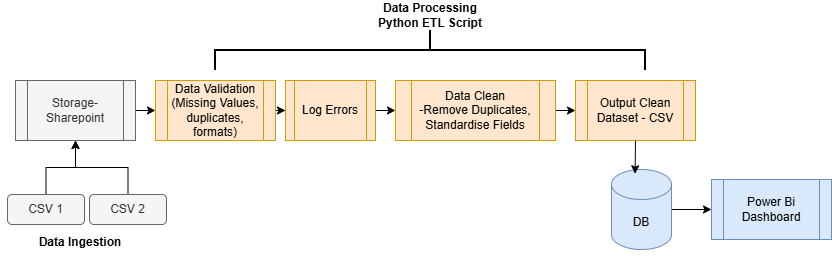
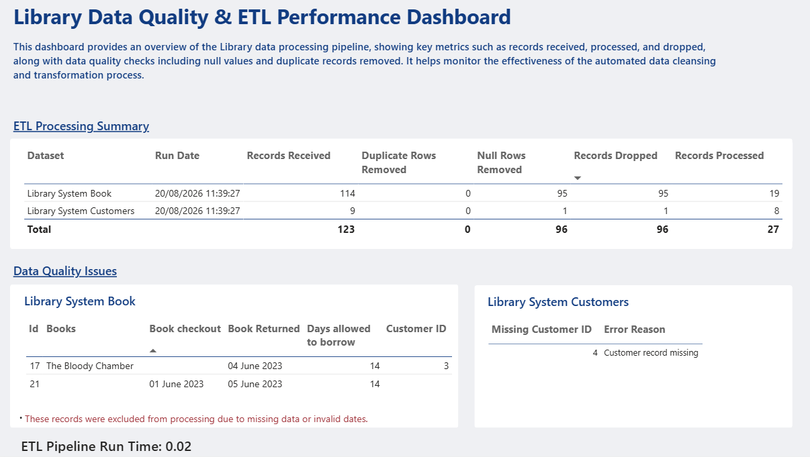
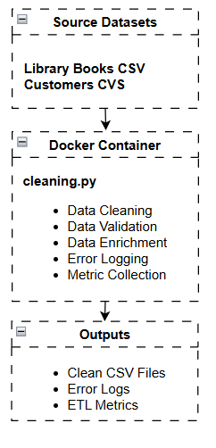

# Module-5
Data Engineering Product Development Module 5 - Tia

## Project Problem Summary
This project was developed to improve the quality, reliability, and efficiency of a Library's data processing activities. The existing process relied on manual data quality checks, which were time-consuming and prone to inconsistencies. To address this, an automated ETL (Extract, Transform, Load) solution was desired utilising Python to cleanse, validate, transform, and prepare data for reporting and analysis.

## Solution Proposal
The solution processes Library Book and Customer datasets, performing data quality checks such as identifying and removing null values, detecting duplicate records, validating customer records, and generating error logs for records requiring further investigation. Cleaned datasets and ETL perofrmance metrics are then exported for use in downstream reporting processes.

## ETL Pipeline

## Data Cleaning
- Removed duplicate records.
- Removed records containing missing values.
- Standardised date formats.
- Converted data into appropriate data types.

## Data Enrichment
- Calculated the number of days books were borrowed.
- Added a loan status field (On Loan, Returned On Time, Returned Late).

## Data Validation
- Checked for missing values.
- Validated customer IDs and identified missing records.
- Identified invalid or incomplete records.
- Generated error logs for records requiring investigation.

## ETL Metrics & Monitoring
- Recorded the number of records received.
- Recorded the number of records processed.
- Calculated the number of records dropped.
- Tracked null rows removed.
- Tracked duplicate rows removed.
- Captured pipeline run date and execution time.
- Exported metrics for reporting in Power BI.

## Metrics Dashboard

## Docker Container
This app has also been packaged into a Docker container so that it can run consistently on any machine without needing to install Python or other dependencies. This will make it easier to deploy and reduce setup and configeration issues.

## Further Development Recommendations
This app could be developed further through a CI/CD (Continuous Integration, Continuous Delivery/Deployment) pipeline using Azure DevOps which could automate the testing and deployment of the application whenever changes are made to the code. This would reduce manual work and improve the reliabilty of the code and speed up future updates and releases. 
